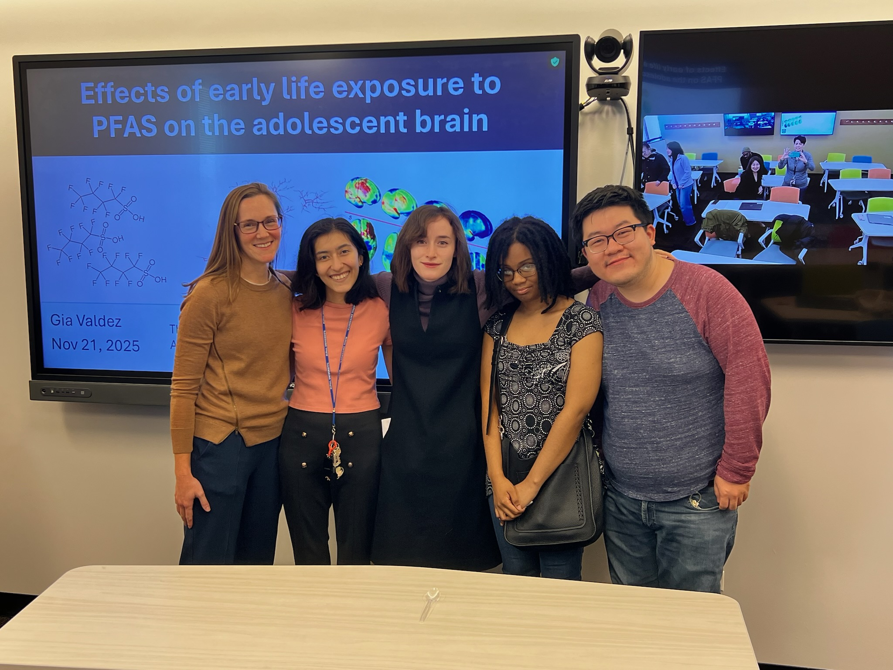
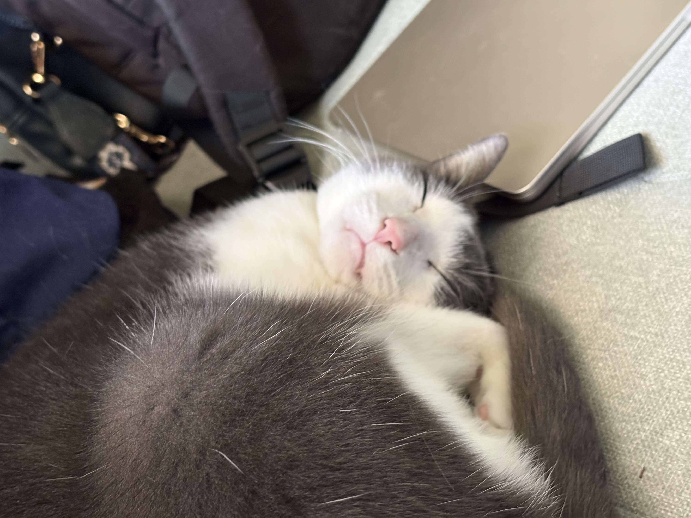
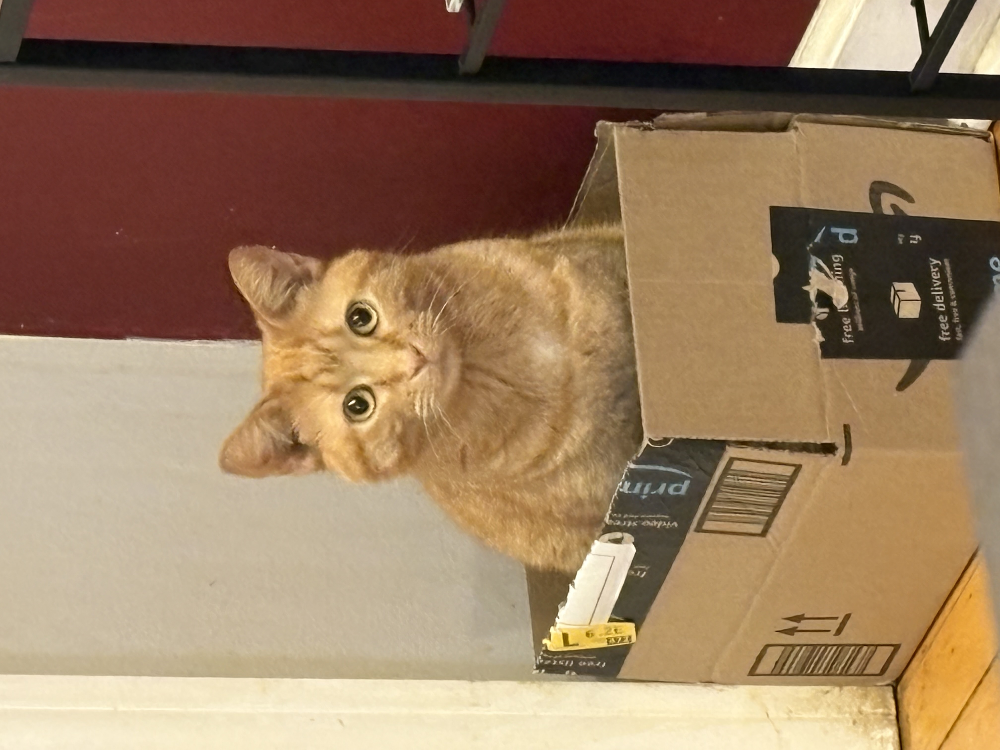
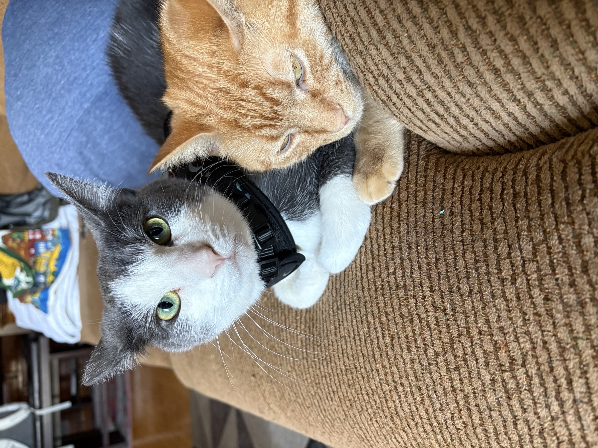

Gia Valdez

Lab Manager, Bell Lab at DePaul University · Incoming Toxicology Ph.D. student at the University of Rochester · Environmental toxicology, neurodevelopment, and neuroimmune signaling

  

    Jump to
    <a class="page-link" href="#work">Research</a>
    <a class="page-link" href="#education">Education</a>
    <a class="page-link" href="#details">CV Details</a>
    <a class="page-link" href="#cats">Cats</a>
    <a class="page-link" href="#contact">Contact</a>
  

  

    Links
    <a href="https://github.com/GVALDEZ9">GitHub</a>
    <a href="assets/Gia_Valdez_CV_2026.pdf">PDF CV</a>
    <a href="cv.md">Text CV</a>
    <a href="mailto:gvaldez9@depaul.edu">Email</a>
    <button type="button" id="surprise-button">Surprise me</button>
    <button type="button" id="cat-button">Cat break</button>
    <button type="button" id="details-toggle">Open all</button>
    <button type="button" id="theme-toggle">Dark mode</button>
  

  

    <h2>Hi there</h2>
    
I study how environmental contaminants shape the brain and immune system during sensitive windows of development. I am especially interested in PFAS, PCBs, microglia, sex differences, and why early exposures can keep mattering long after the exposure window has passed.

    
I recently completed my M.S. in Biological Sciences at DePaul University. Right now, I am the lab manager for Dr. Margaret Bell's lab at DePaul and an incoming Toxicology Ph.D. student at the University of Rochester.

  

  <figure class="site-photo">
    
    <figcaption>After my master's thesis defense on early life PFAS exposure and the adolescent brain.</figcaption>
  </figure>

  

    <strong>Now</strong>
    Lab manager in the Bell Lab at DePaul and incoming Toxicology Ph.D. student at Rochester.
  

  

    <strong>Research home</strong>
    Environmental toxicology, microglia, PFAS, PCBs, sex differences, and developmental windows.
  

  

    <strong>How I work</strong>
    Wet lab experiments paired with RNA seq, pathway analysis, and careful biological interpretation.
  

  

    <strong>Research map</strong>
    
Pick a theme to see how I connect exposures, brain development, immune signaling, and computation.

  

  

    <button type="button" class="map-node node-pfas" data-open-detail="exposures" data-note="PFAS and PCBs are useful models for asking how long lasting chemicals interact with endocrine, immune, metabolic, and developmental systems.">PFAS and PCBs</button>
    <button type="button" class="map-node node-microglia" data-open-detail="immune" data-note="Microglia are where a lot of my questions meet: immune challenge, brain development, sex differences, and prior exposure history.">Microglia</button>
    <button type="button" class="map-node node-sex" data-open-detail="immune" data-note="Sex differences matter because the same exposure can change the magnitude, timing, or direction of a neuroimmune response.">Sex differences</button>
    <button type="button" class="map-node node-window" data-open-detail="windows" data-note="I think a lot about timing: early life, adolescence, and reproductive development are not interchangeable exposure windows.">Developmental windows</button>
    <button type="button" class="map-node node-rnaseq" data-open-detail="programming" data-note="I use R, Python, RNA seq, and pathway analysis to connect gene level results back to the biology collaborators actually care about.">RNA seq</button>
  

<section id="work">
<h2>What I Work On</h2>
</section>

At DePaul, I study how early life exposure to environmental contaminants affects neuroimmune and neuroendocrine development. My master's thesis, **Early Life Exposure to PFAS Affects Adolescent Neuroimmune Activity**, investigated how developmental PFOS exposure changes neural and immune responses following an adolescent inflammatory challenge.

I also manage and contribute to projects examining how perinatal PCB exposure affects neonatal and adolescent neuroimmune outcomes.

  <button type="button" data-open-detail="exposures">PFAS and PCBs</button>
  <button type="button" data-open-detail="immune">Microglia</button>
  <button type="button" data-open-detail="windows">Developmental windows</button>
  <button type="button" data-open-detail="programming">R and Python</button>

  

    
Environmental exposures

    
I am interested in contaminants that do not act like simple one time toxic insults. PFAS, PCBs, and other endocrine disrupting chemicals can interact with hormonal, immune, metabolic, and developmental systems. For me, the important question is not only whether an exposure changes an outcome, but when the exposure happens and which biological system is most vulnerable at that time.

  

  

    
Brain and immune signaling

    
Microglia sit at the center of many questions I care about. They respond to immune challenge, shape brain development, and can behave differently depending on sex, age, and prior exposure history. I am especially interested in how environmental contaminants change the way microglia respond when the immune system is challenged later in life.

  

  

    
Developmental windows

    
Development is not one uniform window. Early life, adolescence, and reproductive development each have different vulnerabilities. I want to understand how exposure during one window can alter later neuroimmune or neuroendocrine responses, and whether some effects persist through epigenetic, reproductive, or long term immune mechanisms.

  

  

    
Programming languages and computational tools

    
I most often use R and Python for data analysis, visualization, and RNA seq interpretation. I also use Jupyter Notebooks, SQL, GraphPad Prism, SPSS, and Jamovi.

    
I like computational work most when it stays close to the biology: checking model outputs, asking whether pathway results make biological sense, and turning complicated data into figures that collaborators can actually use.

  

<section id="education">
<h2>Education And Experience</h2>
</section>

  

    
Education

    
<strong>University of Rochester</strong> Ph.D. in Toxicology, incoming

    
<strong>DePaul University</strong> M.S. in Biological Sciences Thesis Advisor: Dr. Margaret Bell Thesis: <em>Early Life Exposure to PFAS Affects Adolescent Neuroimmune Activity</em>

    
<strong>DePaul University Honors College</strong> B.S. in Neuroscience and Psychology, 2023 Minors in Biology and Japanese Language

  

  

    
Research experience

    
<strong>Lab Manager, Bell Lab, DePaul University</strong> 2025 to present Effects of early life perinatal PCB exposure on neonatal and adolescent neuroimmune and neuroendocrine endpoints.

    
<strong>Graduate Research Assistant, Bell Lab, DePaul University</strong> 2024 to present Early life PFOS exposure and adolescent neural and neuroimmune responses following inflammatory challenge.

    
<strong>Undergraduate Research Assistant, Bell Lab, DePaul University</strong> 2022 to 2024 Perinatal PCB exposure, adolescent ethanol challenge, and immediate early gene mapping.

    
<strong>Undergraduate Integrative Research Assistant, Field Museum</strong> 2022 to 2024 Machine learning pipelines for bryophyte specimen image classification.

  

<section id="details">
<h2>More About The Work</h2>
</section>

  

    
Selected publications and presentations

    <ul>
      <li>Gia M Valdez, Jennifer Dinh, Simone Rhodes, Margaret R Bell. Effects of acute alcohol on adolescent rat brain responses after gestational Polychlorinated Biphenyls exposure. In preparation, 2026.</li>
      <li>Margaret R Bell, Katherine A Walker, Gia M Valdez, Carissa E Dressel. Advances and challenges in studying effects of EDCs on tissue resident macrophages in inflammation. <em>Journal of the Endocrine Society</em>, 2026. <a href="https://doi.org/10.1210/jendso/bvag044">https://doi.org/10.1210/jendso/bvag044</a></li>
      <li>Gia M Valdez, Jemimah Ross, Lidan Zhao, Robert Sargis, Margaret R Bell. Effects of Early Life Exposure to PFAS on Adolescent Neuroimmune Activity. <em>The Toxicologist</em>, abstract submitted for 2026.</li>
      <li>Gia M Valdez, Jennifer Dinh, Margaret R Bell. Gestational exposure to polychlorinated biphenyls alters adolescent neuroimmune responses to ethanol challenge in the limbic system. <em>The Toxicologist</em>, Abstract 4654, 2025.</li>
      <li>Gia M Valdez, Jemimah N Ross, Carissa E Dressel, Margaret R Bell. Effects of early life environmental contaminant exposure on hypothalamic responses to acute alcohol challenge in adolescence. Society for Neuroscience, 2024.</li>
    </ul>
  

  

    
Teaching and mentorship

    
At DePaul, I have taught and supported students in genetics, cell biology, physiology, anatomy, and summer research programming. I have also mentored undergraduate researchers through projects involving data interpretation, Python and R model outputs, and scientific presentations.

  

  

    
Wet lab and tissue skills

    
<strong>Molecular and cellular techniques:</strong> qPCR, RNA isolation, cDNA synthesis, primary cell culture, MACS cell separation, immunohistochemistry, immunocytochemistry.

    
<strong>Animal and tissue work:</strong> in vivo chemical exposure, perfusion, targeted tissue collection, multi organ tissue collection, cryostat sectioning.

    
<strong>Imaging and analysis:</strong> confocal microscopy, ImageJ, cell quantification, figure preparation.

  

  

    
Honors and awards

    <ul>
      <li>Neuroscience Scholars Program Associate, Society for Neuroscience, 2024 to present</li>
      <li>Graduate Research Fund recipient, DePaul University, 2024</li>
      <li>Master's Undergraduate Scholarly Engagement Award, DePaul University, 2024</li>
      <li>Perry J. Gehring Diversity Student Travel Award, Society of Toxicology, 2024</li>
      <li>Undergraduate Diversity Travel Award, Society of Toxicology, 2023</li>
      <li>Organization for the Study of Sex Differences Undergraduate Attendee Award, 2023</li>
      <li>DOORS Scholarship recipient, Promega and BTCI Institute, 2022</li>
    </ul>
  

<section id="cats">
<h2>Killian And Girasol</h2>
</section>

This is the very serious non scientific section.

  <figure class="cat-card">
    
    <figcaption><strong>Killian.</strong> Gray and white. Professional napper.</figcaption>
  </figure>
  <figure class="cat-card">
    
    <figcaption><strong>Girasol.</strong> Orange. Box enthusiast.</figcaption>
  </figure>
  <figure class="cat-card portrait">
    
    <figcaption><strong>Together.</strong> A rare diplomatic summit.</figcaption>
  </figure>

<section id="contact">
<h2>Contact</h2>
</section>

Email: gvaldez9@depaul.edu  
GitHub: [GVALDEZ9](https://github.com/GVALDEZ9)

Last updated: June 8, 2026

